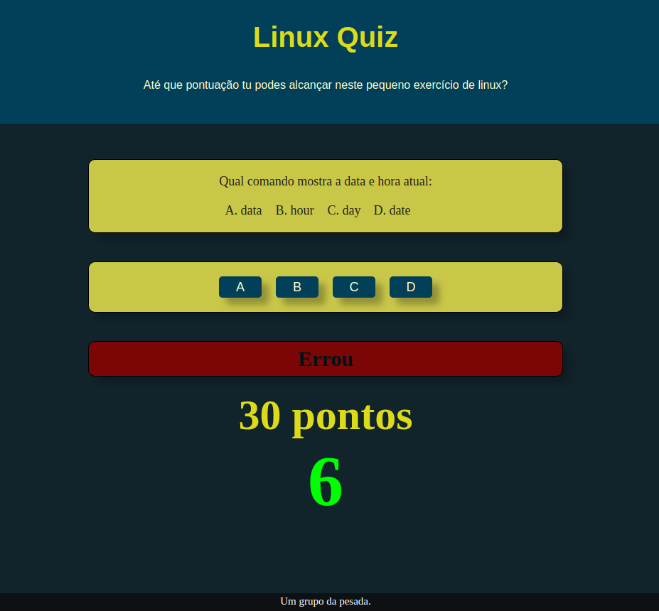

# Projeto de Quiz Linux

    Lógica por: LPLA-br  
    Estilização por: Edson-Silva-22

    Protótipo de quiz Linux utilizado no curso de sistemas para internet na disciplina
    de desenvolvimento front-end.

